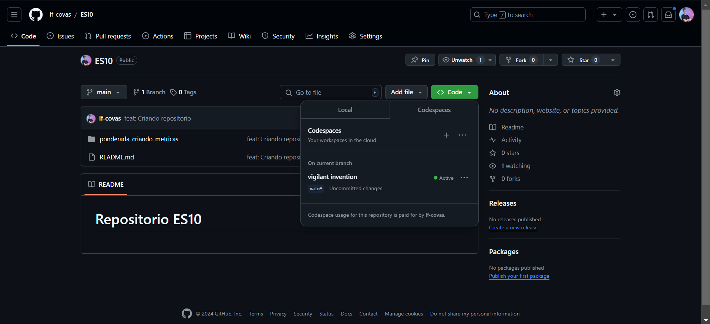
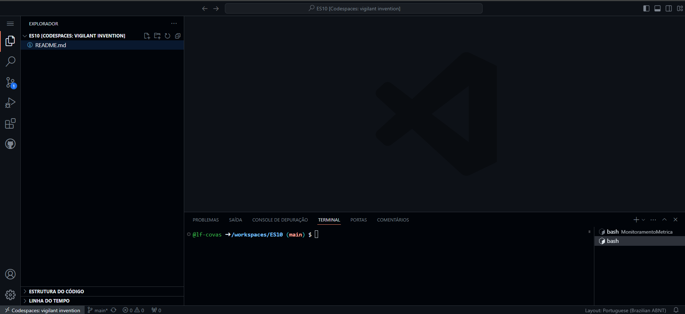
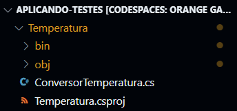
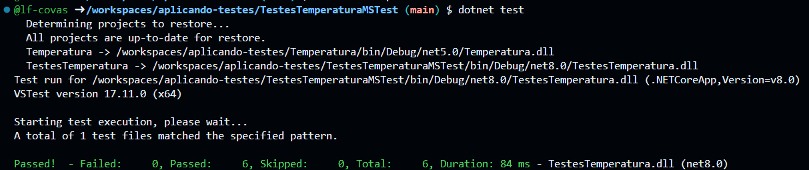
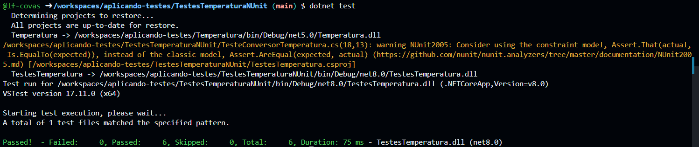
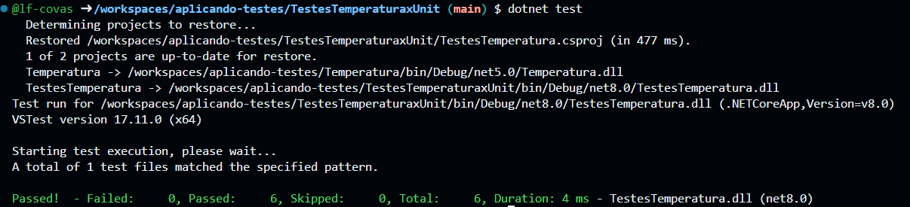
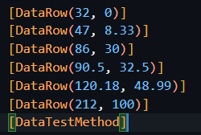
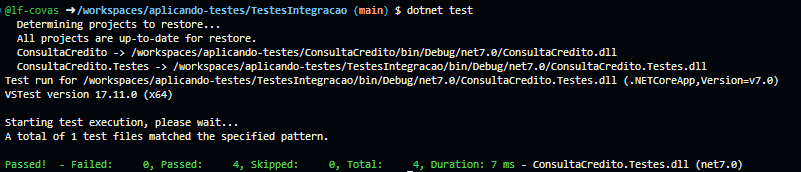
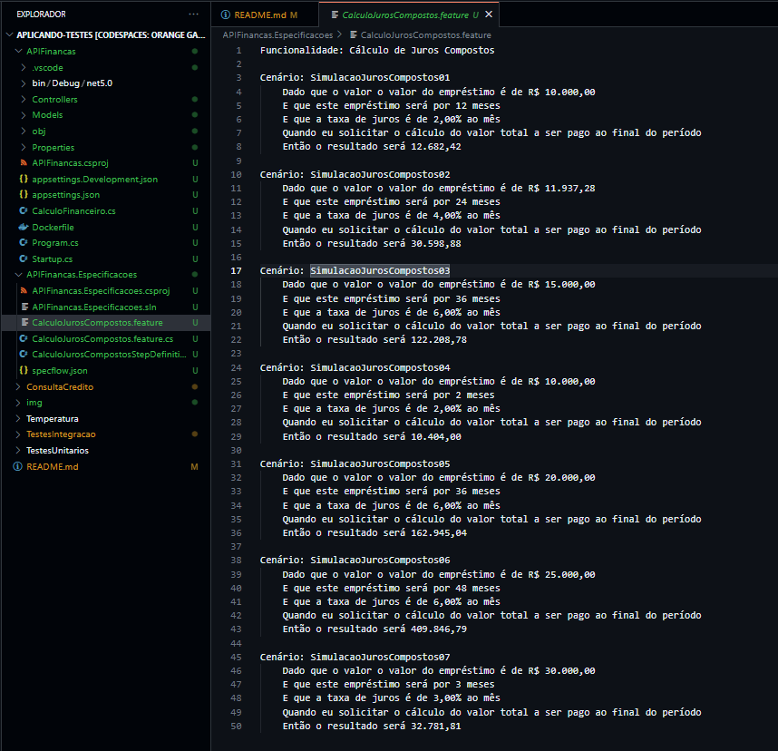
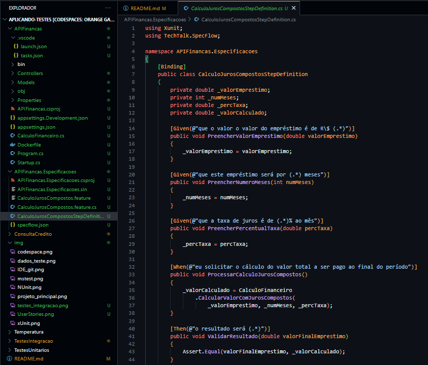

# Ponderada Testes de Integração

Este tutorial mostra como implementar e executar testes unitários em uma aplicação .NET utilizando xUnit, NUnit ou MSTest. Utilizamos o Codespaces do GitHub para simplificar o ambiente de desenvolvimento.

Abra o Codespaces no repositório do GitHub para configurar seu ambiente automaticamente.



Figura 1: Iniciando Codespace no repositório do GitHub.

Após abrir o Codespace, você verá o ambiente de desenvolvimento integrado (IDE) diretamente no navegador.



Figura 2: Interface do IDE no GitHub Codespaces.

### Criando o Projeto Principal

No terminal integrado, crie o projeto principal com o comando:

```
dotnet new classlib -n Temperatura
```

Isso criará uma biblioteca de classes chamada Temperatura, que conterá a lógica da nossa aplicação.



Figura 3: Criando o projeto principal.

### Implementando a Classe Principal

No arquivo `ConversorTemperatura.cs`, implemente a lógica da aplicação. Por exemplo, para converter temperaturas de Fahrenheit para Celsius:

```C#
using System;

namespace Temperatura
{
    public static class ConversorTemperatura
    {
        public static double FahrenheitParaCelsius(double temperatura)
            //=> (temperatura - 32) / 1.8; // Simulação de falha
            => Math.Round((temperatura - 32) / 1.8, 2);
    }
}
```

### Criando o Projeto de Testes

Volte ao diretório raiz e crie o projeto de testes utilizando o framework de sua escolha:

**Usando xUnit**

`dotnet new xunit -n TestesTemperaturaXUnit`

**Usando NUnit**

`dotnet new nunit -n TestesTemperaturaNUnit`

**Usando MSTest**

`dotnet new mstest -n TestesTemperaturaMSTest`

Esses comandos criam um novo projeto de testes chamado TestesTemperatura(framework preferido).

### Adicionando Referência ao Projeto Principal

Adicione uma referência ao projeto principal (Temperatura) no projeto de testes:

```
dotnet add reference ../Temperatura/Temperatura.csproj
```

Nota: Faça isso para todos os projetos de testes. Após executar este comando, os projetos de testes poderam acessar as classes e métodos do projeto principal.

### Implementando os Testes

No arquivo TesteConversorTemperatura.cs dentro do projeto de testes com xUnit, implemente o teste conforme código abaixo:

```C#
using System;
using Xunit;

namespace Temperatura.Testes
{
    public class TestesConversorTemperatura
    {
        [Theory]
        [InlineData(32, 0)]
        [InlineData(47, 8.33)]
        [InlineData(86, 30)]
        [InlineData(90.5, 32.5)]
        [InlineData(120.18, 48.99)]
        [InlineData(212, 100)]
        public void TestarConversaoTemperatura(
            double fahrenheit, double celsius)
        {
            double valorCalculado =
                ConversorTemperatura.FahrenheitParaCelsius(fahrenheit);
            Assert.Equal(celsius, valorCalculado);
        }
    }
}
```
No arquivo TesteConversorTemperatura.cs dentro do projeto de testes com NUnit, implemente o teste conforme código abaixo:

```C#
using NUnit.Framework;

namespace Temperatura.Testes
{
    public class TestesConversorTemperatura
    {
        [TestCase(32, 0)]
        [TestCase(47, 8.33)]
        [TestCase(86, 30)]
        [TestCase(90.5, 32.5)]
        [TestCase(120.18, 48.99)]
        [TestCase(212, 100)]
        public void TesteConversaoTemperatura(
            double tempFahrenheit, double tempCelsius)
        {
            double valorCalculado =
                ConversorTemperatura.FahrenheitParaCelsius(tempFahrenheit);
            Assert.AreEqual(tempCelsius, valorCalculado);
        }
    }
}
```
No arquivo TesteConversorTemperatura.cs dentro do projeto de testes com MSTest, implemente o teste conforme código abaixo:

```C#
using Microsoft.VisualStudio.TestTools.UnitTesting;

namespace Temperatura.Testes
{
    [TestClass]
    public class TestesConversorTemperatura
    {
        [DataRow(32, 0)]
        [DataRow(47, 8.33)]
        [DataRow(86, 30)]
        [DataRow(90.5, 32.5)]
        [DataRow(120.18, 48.99)]
        [DataRow(212, 100)]
        [DataTestMethod]
        public void TesteConversaoTemperatura(
            double tempFahrenheit, double tempCelsius)
        {
            double valorCalculado =
                ConversorTemperatura.FahrenheitParaCelsius(tempFahrenheit);
            Assert.AreEqual(tempCelsius, valorCalculado);
        }
    }
}
```

### Executando os Testes

Compile e execute os testes para garantir que tudo está funcionando corretamente:

Navegue até a pasta do projeto de cada teste e execute o comando:

```
dotnet test
```

O terminal exibirá os resultados para cada teste conforme imagens abaixo:

Realizando testes com MSTest:



Figura 4: Terminal com resultados do MSTest

Realizando testes com NUnit:



Figura 5: Terminal com resultado do NUnit

Realizando testes com xUnit:



Figura 6: Terminal com resultado do Xunit

# Testes Implementados

Este repositório contém testes implementados para garantir a qualidade e a funcionalidade do projeto. Abaixo estão descrições detalhadas para cada tipo de teste implementado, incluindo exemplos de cenários práticos conforme soliticato.

## 1. Testes Unitários

Os testes unitários garantem que os menores blocos de código da aplicação funcionem corretamente de forma isolada. Eles verificam a precisão das funções ou métodos individuais.

**Objetivo:** Os testes unitários foram aplicados para verificar se a lógica de conversão de temperaturas de Fahrenheit para Celsius está correta.

No arquivo TestesConversorTemperatura.cs em qualquer tipo de framework de testes, os testes utilizam diferentes valores de entrada para validar a precisão do método FahrenheitParaCelsius.



Podemos verificar se o ponto de congelamento e ebulição da água está correta para ambas as medidas.

Congelamento da água:

- Entrada: 32°F
- Saída esperada: 0°C
- Resultado do teste: Passou.

Ponto de ebulição da água:

- Entrada: 212°F
- Saída esperada: 100°C
- Resultado do teste: Passou.

# Testes de Integração com Moq, xUnit e FluentAssertions
Este tutorial também cobre a implementação de testes de integração em um sistema .NET utilizando as ferramentas Moq, xUnit, e FluentAssertions. Esses testes são projetados para validar a integração de diferentes componentes do sistema e garantir que eles funcionem corretamente quando combinados.

## Objetivo dos Testes de Integração
Os testes de integração têm como objetivo validar cenários mais complexos do sistema, onde múltiplos componentes interagem. No contexto deste projeto, testamos a classe AnaliseCredito, que depende do serviço IServicoConsultaCredito para verificar a situação de crédito de um CPF.

Utilizamos Moq para simular o comportamento de IServicoConsultaCredito, permitindo criar cenários de teste personalizados.

### Ferramentas Utilizadas
- Moq: Framework de mocking para simular dependências e facilitar o teste de componentes isolados.
- xUnit: Framework de teste unitário utilizado para organizar e executar os testes.
- FluentAssertions: Biblioteca para criar assertivas mais legíveis e expressivas.

### Configuração dos Testes
Definição dos Cenários: Os cenários de teste definidos validam diferentes comportamentos de IServicoConsultaCredito:

**CPF Inválido:** Quando o CPF é inválido, o sistema deve retornar um status de erro.

**Erro de Comunicação:** Quando há uma falha na comunicação com o serviço, o sistema deve capturar a exceção e retornar um status apropriado.

**CPF Sem Pendências:** Quando o CPF não possui pendências, o sistema deve retornar um status de "Sem Pendências".

**CPF Inadimplente:** Quando o CPF possui pendências, o sistema deve retornar um status de "Inadimplente".

Para que você possa verificar o código responsavel por isso, acesse o arquivo `TestesAnaliseCredito.cs` dentro da pasta TestesIntegração.

Para executar os testes e verificar o resultado, navegue até a pasta TestesIntegração e execute o comando `dotnet test`. Assim você verá no seu terminal uma imagem como abaixo:




# Automatizando Testes com SpecFlow, GitHub Actions e Azure DevOps
Neste tutorial tabém cobre testes automatizados utilizando o SpecFlow para testes de aceitação, o SpecFlow é uma alternativa open source muito útil quando optamos por abordagens como BDD (Behavior Driven Development), possibilitando a execução de testes de validação de funcionalidades de um projeto através de user stories.

### Objetivo
Validar cenários de negócio diretamente no código, garantindo que a aplicação funciona como esperado sob as condições descritas pelos stakeholders.

Arquivo com todas as features necessarias:



Arquivo com exemplo de class criada:

